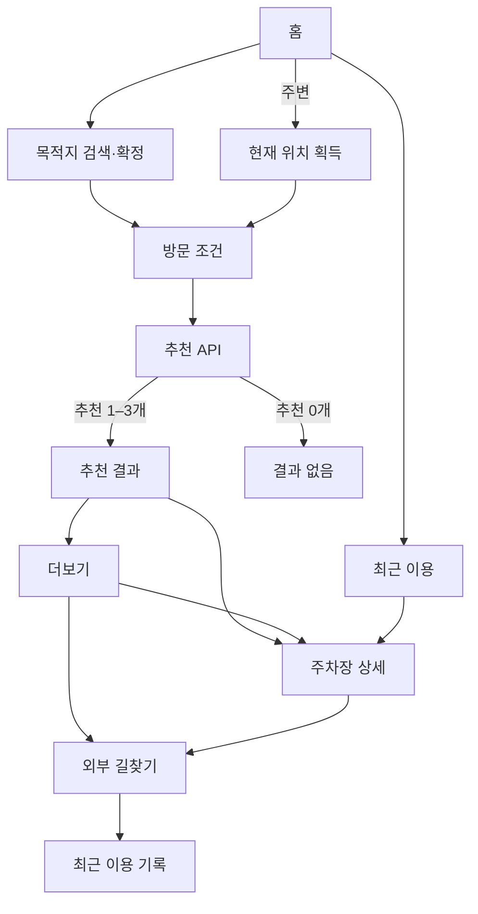

# 주차의 민족 MVP 프론트엔드 마스터 스펙

| 항목        | 값                                                         |
| ----------- | ---------------------------------------------------------- |
| 버전        | 2.1.1                                                      |
| 기준일      | 2026-08-10                                                 |
| 디자인      | [V6 manifest](./design/design-manifest.md), node `89:1382` |
| 플랫폼      | 모바일 웹, Capacitor iOS·Android                           |
| 데이터 범위 | 서울시 공영주차장                                          |

이 문서는 전체 시스템의 범위·기능 연결·스펙 위치만 정의한다. 세부 구현은 기능별 스펙, API wire는 백엔드 API 계약서를 따른다.

## 1. 제품 목표

사용자가 목적지 또는 현재 위치와 방문 시간을 정하고, 직선거리 600m 안의 서울시 공영주차장을 비교한 뒤 외부 지도 길찾기를 시작할 수 있어야 한다.

완료 흐름:

1. 검색: 홈 → 목적지 검색·확정 → 방문 조건 → 추천 결과 → 상세·더보기 → 외부 지도
2. 주변: 홈의 주변 탭 → 현재 위치 획득 → 방문 조건 → 추천 결과 → 상세·더보기 → 외부 지도

추천은 서로 다른 주차장으로 최대 3개다. 추천이 0개면 결과 없음만 표시하고 더보기는 노출하지 않는다.

## 2. 고정 제품 결정

| ID   | 결정                                                              |
| ---- | ----------------------------------------------------------------- |
| P-01 | 검색 반경은 목적지 직선거리 600m로 고정한다.                      |
| P-02 | 검색·추천·상세 대상은 서울시 공영주차장만이다.                    |
| P-03 | 추천 유형은 `DISTANCE`, `PRICE`, `BALANCED`이며 최대 1개씩이다.   |
| P-04 | 거리·요금·운영·rank·추천·중복 제거는 백엔드가 계산한다.           |
| P-05 | 결과 최초 category와 선택은 BALANCED이며, 없으면 API 첫 추천이다. |
| P-06 | 결과·더보기는 거리순·가격순·균형순을 서버 rank로 정렬한다.        |
| P-07 | 추천 이유·실시간 여석·목적지 최근 검색은 MVP에서 제외한다.        |
| P-08 | 최근 이용은 외부 길찾기 전달 성공 시 기기 로컬에 저장한다.        |
| P-09 | 외부 길찾기는 네이버 지도·카카오맵·TMAP을 제공한다.               |
| P-10 | 웹과 Capacitor 앱은 같은 React 화면과 도메인 모델을 사용한다.     |

## 3. 시스템 흐름



## 4. 문서 지도

한 규칙은 아래 소유 문서 한 곳에서만 정의한다. 다른 문서는 해당 파일을 링크한다.

| 영역         | 소유 문서                                              | 포함 내용                                        |
| ------------ | ------------------------------------------------------ | ------------------------------------------------ |
| 공통 FE 계약 | [공통 프론트엔드 계약](./specs/00-shared-contracts.md) | 기술 경계, 공통 타입, 세션, 오류·접근성·개인정보 |
| 앱 셸·route  | [앱 셸·홈·내비게이션](./specs/01-navigation-home.md)   | 홈, 탭, guard, history, back                     |
| 목적지       | [목적지 검색·확정](./specs/02-destination-search.md)   | 자동완성, 후보 선택, 목적지 확정                 |
| 방문 시간    | [방문 날짜·입출차 시각](./specs/03-visit-time.md)      | 10분 피커, 기본값, 날짜 파생, 제출               |
| 추천·더보기  | [추천 결과·더보기](./specs/04-recommendations-more.md) | BALANCED 최초 선택, rank 정렬, 카드·marker, 0건  |
| 상세         | [주차장 상세](./specs/05-parking-detail.md)            | 문맥별 상세 request·표시·오류                    |
| 지도·위치    | [지도·현재 위치](./specs/06-map-location.md)           | 네이버 SDK, marker, 권한, 현재 위치              |
| 외부 지도    | [외부 지도 길찾기](./specs/07-external-directions.md)  | provider URL, 웹·Capacitor adapter, 결과 상태    |
| 최근 이용    | [최근 이용](./specs/08-recent-use.md)                  | localStorage schema, 정리, 목록                  |
| API wire     | [백엔드 API 계약서](./backend-api-contract.md)         | endpoint, DTO, 오류코드, 서버 불변조건·계산 규칙 |
| 디자인       | [디자인 manifest](./design/design-manifest.md)         | Figma·화면 export·상태·스펙 변경점·누락 자료     |
| AI 개발 절차 | [AI 기능 개발 실행 가이드](./agentic-development.md)   | clarify→plan→tasks→analyze→implement             |

## 5. Route 개요

| Path                          | 기능                |
| ----------------------------- | ------------------- |
| `/`                           | 홈                  |
| `/search`                     | 목적지 검색         |
| `/destination`                | 목적지 확정         |
| `/visit`                      | 방문 조건           |
| `/results`                    | 추천 결과·결과 없음 |
| `/parking-lots`               | 더보기              |
| `/parking-lots/:parkingLotId` | 주차장 상세         |
| `/recent`                     | 최근 이용           |

세부 guard·history 규칙은 [앱 셸 스펙](./specs/01-navigation-home.md)을 따른다.

## 6. 전역 상태와 데이터 흐름

검색 세션은 다음 값만 공유한다.

- 확정 목적지
- 방문 조건 draft와 서버 확정 방문 조건
- 추천 API response
- 선택 category
- 선택 `parkingLotId`

데이터 흐름:

```text
사용자 입력
  → 프론트 형식 검증
  → 백엔드 API
  → response runtime 검증
  → 검색 세션 저장
  → 카드·목록·지도 렌더링
  → 외부 지도 adapter
  → DISPATCHED일 때 최근 이용 저장
```

- 지도 SDK DTO와 API DTO는 adapter 경계에서 도메인 타입으로 변환한다.
- 화면은 browser·Capacitor API를 직접 호출하지 않고 platform adapter를 사용한다.
- 현재 위치는 메모리, 최근 이용만 localStorage에 보관한다.

## 7. 포함·제외 범위

포함:

- 목적지 검색·현재 위치
- 방문 날짜·입출차 입력
- 추천 최대 3개와 600m 전체 목록
- 지도·카드·목록 선택 동기화
- 상세와 외부 길찾기 3종
- 최근 이용
- 정상 0건, 입력·network·지도·위치·계약 오류

제외:

- 로그인, 예약, 결제, 즐겨찾기
- 민영·타 지자체 주차장
- 반경 변경·자동 확장·반경 밖 노출
- 실시간 여석, 추천 이유, 목적지 최근 검색
- 복합 요금의 프론트 계산
- 기본 길찾기 앱 기억
- 최근 이용 server sync
- background 위치와 offline 기능
- 관리자 데이터 동기화 UI·API
- 24시간 초과 체류 입력

## 8. 구현 순서

1. 공통 타입·route·검색 세션·platform adapter 경계
2. 목적지 검색·확정
3. 방문 조건과 시간 직렬화
4. 추천 API 연동·결과·더보기
5. 상세
6. 네이버 지도·현재 위치
7. 외부 길찾기·최근 이용
8. 오류·접근성·웹/네이티브 smoke 검증

## 9. 환경 준비물

| Key·설정              | 용도                                 |
| --------------------- | ------------------------------------ |
| `API_BASE_URL`        | 백엔드 base URL                      |
| `NAVER_MAP_CLIENT_ID` | 네이버 지도 JS SDK                   |
| `NAVER_MAP_APP_NAME`  | 네이버 외부 지도 호출자 식별         |
| `TMAP_APP_KEY`        | TMAP invoke 제한 key                 |
| `CAPACITOR_APP_ID`    | Android application ID·iOS bundle ID |
| History rewrite       | SPA route를 `index.html`로 연결      |
| 위치 권한 문구        | iOS·Android foreground 위치          |

실제 key는 저장소에 기록하지 않는다.

## 10. 스펙 변경 규칙

- API path·field·error·서버 계산 변경 → `backend-api-contract.md`와 영향받는 기능 스펙 수정
- route·전역 상태·기능 연결 변경 → 이 마스터와 해당 기능 스펙 수정
- 기능 내부 상태·문구·조건 변경 → 해당 기능 스펙만 수정
- 색상·간격·asset 변경 → Figma와 디자인 manifest의 버전·상태 수정
- 자동 테스트는 MVP 범위에서 제외하고 기능별 완료 조건과 smoke 검증으로 확인

구현과 문서가 다르면 코드를 기준으로 문서를 사후 보정하지 않는다. 먼저 합의된 스펙을 변경한 뒤 구현한다.
